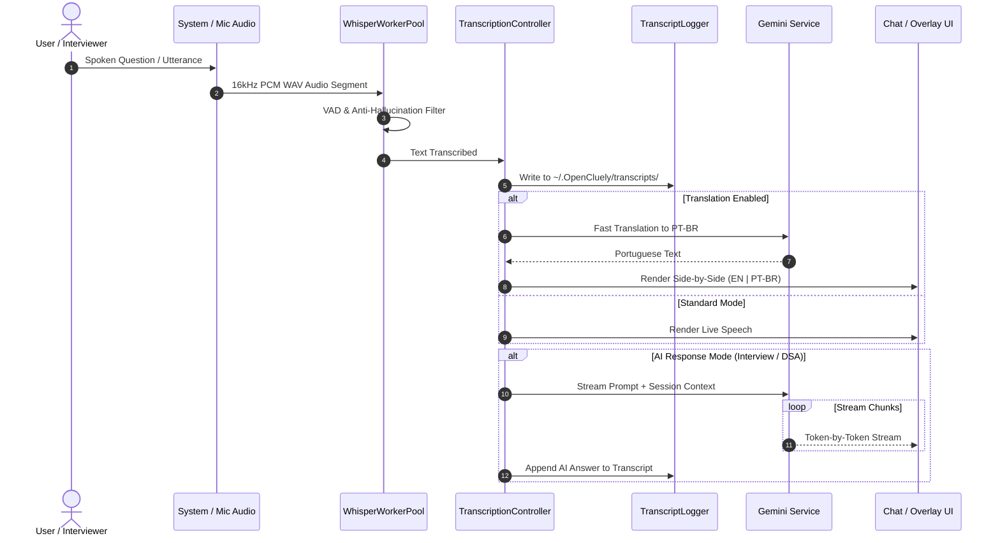

<div align="center">

# OpenCluely

**The invisible, real-time AI interview copilot & intelligent meeting companion.**

Real-time multi-modal AI reasoning, dual-source audio transcription, real-time bilingual translation, and automated call logging — delivered through a stealth screen overlay that conference tools cannot capture.

<p>
  <a href="https://github.com/TechyCSR/OpenCluely/releases/latest"></a>
  <a href="LICENSE"></a>
  
  
  
</p>

<a href="#-key-features">Key Features</a> &nbsp;|&nbsp;
<a href="#-system-architecture">Architecture</a> &nbsp;|&nbsp;
<a href="#-audio--transcription-pipeline">Audio Pipeline</a> &nbsp;|&nbsp;
<a href="#-quick-start">Quick Start</a> &nbsp;|&nbsp;
<a href="#-shortcuts">Shortcuts</a> &nbsp;|&nbsp;
<a href="#-configuration-reference">Configuration</a> &nbsp;|&nbsp;
<a href="#-project-structure">Project Structure</a>

</div>

---

## 🌟 Key Features

### 1. 🛡️ Invisible Stealth Overlay & Anti-Detection
- **OS-Level Screen-Share Exclusion**: Leverages OS window flags (`NSWindowSharingNone` on macOS, `WDA_EXCLUDEFROMCAPTURE` on Windows via `setContentProtection(true)`). The overlay is 100% invisible to Zoom, Google Meet, Microsoft Teams, Discord, Slack, and OBS.
- **Process Camouflage & Title Disguise**: Configurable window titles and masquerading processes (e.g. `Calculator`, `Notes`, `System Activity`).
- **Click-Through Transparency (`Alt + A`)**: Instantly toggle between full mouse/keyboard interaction and transparent click-through so you can code or navigate during calls without moving the overlay.
- **Auto-Hide on Screen Share**: Automatically minimizes or hides windows when screen sharing is detected.

---

### 2. 🎙️ Dual-Audio & Whisper Worker Pool
- **Dual-Source Audio Capture**: Captures both microphone input and system audio loopback (interviewer speech from conference apps).
- **Parallel Whisper Worker Pool**: Multi-process worker pool (`WhisperWorkerPool`) that handles speech segments concurrently to eliminate transcription backpressure.
- **Voice Activity Detection (VAD) & Anti-Hallucination**: High-precision energy gating that suppresses background noise and discards silence hallucinations.
- **Dual Backend**: Offline local Whisper with optional CUDA GPU acceleration or cloud-based Azure Cognitive Services.

---

### 3. 🌐 Real-Time Side-by-Side Bilingual Translation (PT-BR)
- **Live Translation Column**: Instantly translates spoken English (or any language) to Brazilian Portuguese.
- **Dual-Column UI**: Displays spoken original transcript on the left and Portuguese translation on the right.
- **Fast Toggle**: One-click `[PT: ON / OFF]` button in the chat toolbar with persistent preference.

---

### 4. 📝 Automated Call Transcript Logging
- **Real-Time Call Auto-Save**: Automatically logs every speech utterance and AI suggestion directly to readable, timestamped text files.
- **Dedicated Storage**: Saved locally in `~/.OpenCluely/transcripts/call-transcript_YYYY-MM-DD_HH-mm-ss.txt`.
- **Structured Reports**: Formatted with timestamps, speaker identifiers (`[SPEECH]`, `[AI ANSWER]`), session start/end metadata, and duration statistics.

---

### 5. 🧠 Multimodal AI Reasoning (Google Gemini)
- **Direct Visual Screen Reasoning (`Cmd/Ctrl + Shift + S`)**: Takes screen/region captures and streams them directly into Gemini for instant problem solving without lossy OCR steps.
- **Low-Latency Streaming**: Token-by-token streaming response rendered in real-time.
- **Rich Code & Math Rendering**: Full syntax highlighting via PrismJS and mathematical formula rendering (LaTeX/MathJax).

---

### 6. 🎯 Specialized Skills & Dynamic Prompts
- **Interview Skill**: Structured guidance, follow-up answers, behavioral tips, and system design insights.
- **DSA Skill**: Optimal algorithms, $O(n)$ time/space complexity analysis, and implementation in C++, Python, Java, JavaScript, or C.
- **Sales & Pitch Skill**: Objection handling, value propositions, and live negotiation assistance.
- **Transcript Skill**: Pure dictation and bilingual translation without invoking AI answer generation.
- **Hot-Reloadable Prompts**: Edit prompt files on the fly without restarting the app.

---

## 🏛️ System Architecture

OpenCluely follows a modular Electron architecture designed for high throughput, memory safety, and complete process isolation.

```mermaid
flowchart TB
    subgraph UI_Layer [Frontend Windows (Renderer Process)]
        Overlay[Floating Stealth Overlay<br/><code>overlay.html</code>]
        Chat[Chat & Bilingual Interface<br/><code>chat.html</code>]
        Settings[Settings Window<br/><code>settings.html</code>]
    end

    subgraph Security_Bridge [IPC & Preload Bridge]
        Preload[Context Isolated Preload<br/><code>preload.js</code>]
    end

    subgraph Core_Controllers [Main Process Controllers]
        Main[Main Coordinator<br/><code>main.js</code>]
        TranscriptionCtrl[Transcription Controller<br/><code>src/controllers/transcription.controller.js</code>]
        CaptureCtrl[Capture Controller<br/><code>src/controllers/capture.controller.js</code>]
        ShortcutCtrl[Shortcut Controller<br/><code>src/controllers/shortcut.controller.js</code>]
    end

    subgraph Audio_Engine [Audio & Speech Pipeline]
        Microphone[Microphone Stream]
        Loopback[System Loopback Audio<br/><code>system-audio.service.js</code>]
        WhisperPool[Whisper Worker Pool<br/><code>whisper-worker.service.js</code>]
        AzureSpeech[Azure Speech Service<br/><code>azure-speech.service.js</code>]
    end

    subgraph AI_Engine [AI & Services Layer]
        LLM[LLM Service & Gemini API<br/><code>src/services/llm.service.js</code>]
        SessionMgr[Session Memory & Disk Store<br/><code>src/managers/session.manager.js</code>]
        TranscriptLogger[Transcript File Logger<br/><code>src/services/transcript-logger.service.js</code>]
        PromptLoader[Prompt Loader & Hot-Reload<br/><code>prompt-loader.js</code>]
    end

    UI_Layer <-->|IPC Channels via ContextBridge| Security_Bridge
    Security_Bridge <--> Core_Controllers
    Microphone & Loopback --> WhisperPool & AzureSpeech
    WhisperPool & AzureSpeech --> TranscriptionCtrl
    TranscriptionCtrl --> TranscriptLogger
    TranscriptionCtrl --> LLM
    CaptureCtrl --> LLM
    LLM <--> SessionMgr
    LLM --> Core_Controllers
    PromptLoader --> LLM
    Core_Controllers --> UI_Layer
```

---

## 🌊 Audio & Transcription Pipeline



---

## ⌨️ Global Shortcuts

| Action | Shortcut | Function |
|---|---|---|
| **Screenshot Analysis** | `Cmd/Ctrl + Shift + S` | Capture display area and reason with Gemini |
| **Toggle Speech Recognition** | `Alt + R` | Start / Stop microphone listening |
| **Toggle Window Visibility** | `Cmd/Ctrl + Shift + V` | Hide / Show all stealth windows |
| **Toggle Click-Through Mode** | `Cmd/Ctrl + Shift + I` or `Alt + A` | Enable or disable mouse transparency |
| **Open Chat Interface** | `Cmd/Ctrl + Shift + C` | Open the full interactive chat and translation panel |
| **Settings Panel** | `Cmd/Ctrl + ,` | Open the configuration panel |

---

## 🚀 Quick Start

### 1. Prerequisites
- **Node.js**: v18.0.0 or higher
- **Python**: 3.9+ (optional, required if using local Whisper)
- **ffmpeg & sox**: (optional, required for local microphone capture)

### 2. Clone and Setup
```bash
# Clone the repository
git clone https://github.com/TechyCSR/OpenCluely.git
cd OpenCluely

# Run the automated setup script
./setup.sh
```

### 3. Configure API Key
OpenCluely requires a Google Gemini API key. Paste your key into the Settings window that opens on first launch, or add it to `.env`:
```env
GEMINI_API_KEY=AIzaSy...
```

---

## ⚙️ Configuration Reference (`.env`)

| Variable | Type | Default | Description |
|---|---|---|---|
| `GEMINI_API_KEY` | `string` | *required* | Google Gemini API key from Google AI Studio |
| `GEMINI_MODEL` | `string` | `gemini-2.5-flash` | Gemini model to use for visual reasoning and chat |
| `SPEECH_PROVIDER` | `string` | `whisper` | Speech engine: `whisper` (local) or `azure` (cloud) |
| `WHISPER_COMMAND` | `string` | `whisper` | Whisper executable command or path |
| `WHISPER_MODEL` | `string` | `small` | Whisper model size (`tiny`, `base`, `small`, `medium`, `large`) |
| `WHISPER_LANGUAGE` | `string` | `auto` | Spoken audio language or `auto` for detection |
| `WHISPER_DEVICE` | `string` | `auto` | Compute device (`cuda`, `cpu`, `auto`) |
| `WHISPER_CAPTURE_MODE`| `string` | `vad` | Voice capture mode (`vad` or `manual`) |
| `WHISPER_RESPONSE_TARGET`| `string`| `both` | Where to stream voice replies (`chat`, `overlay`, `both`) |
| `AZURE_SPEECH_KEY` | `string` | `""` | Azure Speech Cognitive Service API key |
| `AZURE_SPEECH_REGION` | `string` | `""` | Azure Speech region (e.g. `eastus`) |

---

## 📁 Project Structure

```text
OpenCluely/
├── chat.html                     # Chat window & side-by-side bilingual translation UI
├── overlay.html                  # Stealth floating response window
├── settings.html                 # Settings & preferences UI
├── main.js                       # Main process entry point & lifecycle manager
├── preload.js                    # Secure ContextBridge IPC layer
├── prompt-loader.js              # Prompt management & dynamic hot-reloading
├── prompts/                      # Customizable skills prompts (interview, dsa, sales, transcript)
├── scripts/                      # Test suites and diagnostic scripts
│   ├── test-translation-feature.js  # Bilingual translation unit tests
│   ├── test-call-transcript.js      # Transcript file auto-save test suite
│   ├── test-worker-pool.js          # Whisper worker pool concurrency tests
│   ├── test-high-priority.js        # Architectural resilience tests
│   └── test-medium-low.js           # Configuration and audio reconnect tests
├── src/
│   ├── controllers/              # Business logic controllers
│   │   ├── capture.controller.js        # Screen capture & visual reasoning
│   │   ├── shortcut.controller.js       # Global keybinding handlers
│   │   └── transcription.controller.js   # Voice, translation & dispatch pipeline
│   ├── core/                     # Core runtime utilities
│   │   ├── config.js                    # Validated schema & configuration
│   │   ├── first-run.js                 # First-launch onboarding manager
│   │   └── logger.js                    # Winston multi-transport logger
│   ├── managers/                 # State & session managers
│   │   ├── session.manager.js           # Session memory with atomic disk persistence
│   │   └── window.manager.js            # Stealth window management & positioning
│   └── services/                 # External service integrations
│       ├── azure-speech.service.js      # Azure Cognitive Services client
│       ├── capture.service.js           # Multi-monitor screenshot engine
│       ├── llm.service.js               # Gemini 2.5 streaming & translation client
│       ├── system-audio.service.js      # Loopback system audio capture
│       ├── transcript-logger.service.js # Persistent call transcript file writer
│       ├── whisper-speech.service.js    # Local Whisper wrapper
│       └── whisper-worker.service.js    # Multi-process Whisper worker pool
```

---

## 🛡️ Privacy, Security & Anti-Detection

- **Zero Remote Telemetry**: No user data, transcripts, or usage metrics are ever collected or sent to external servers.
- **Local Persistence Only**: All session histories, transcript logs, and temporary audio files stay strictly on your local disk (`~/.OpenCluely`).
- **Encrypted Communication**: Outbound requests to the Google Gemini API are encrypted via standard TLS 1.3.
- **Memory Safety**: Temporary WAV audio chunks are automatically unlinked and cleaned up after processing to avoid disk bloat.

---

## 📄 License

Distributed under the MIT License. See [`LICENSE`](LICENSE) for details.

<div align="center">

Built with ❤️ for privacy-first AI assistance and seamless technical interviews.

</div>
