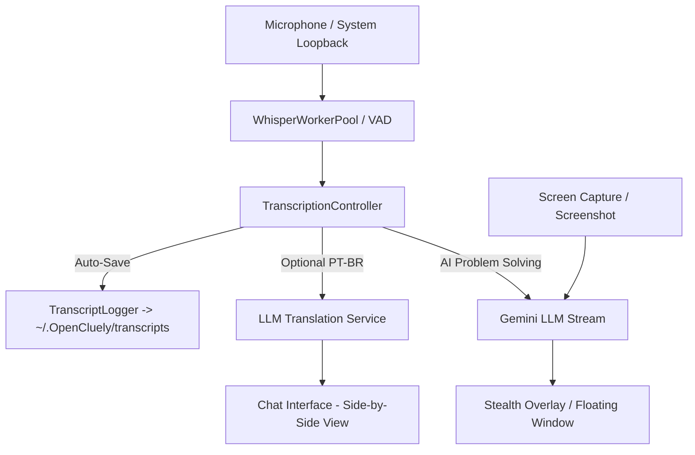

<div align="center">

# OpenCluely

**The invisible AI interview copilot & real-time meeting assistant.**

Real-time AI assistance, transcription, live translation, and call logging on a stealth overlay that conferencing tools cannot capture. Ask by voice or screenshot, get streamed answers, and keep full transcripts of every session.

<p>
  <a href="https://github.com/TechyCSR/OpenCluely/releases/latest"></a>
  <a href="LICENSE"></a>
  
</p>

<a href="#key-features">Key Features</a> &nbsp;|&nbsp;
<a href="#how-it-works">How It Works</a> &nbsp;|&nbsp;
<a href="#quick-start">Quick Start</a> &nbsp;|&nbsp;
<a href="#shortcuts">Shortcuts</a> &nbsp;|&nbsp;
<a href="#configuration">Configuration</a> &nbsp;|&nbsp;
<a href="#architecture">Architecture</a>

</div>

---

## 🌟 Key Features

### 1. 🛡️ Invisible Stealth Overlay
- **Screen Share Immunity**: Windows utilize OS-level window exclusion (`setContentProtection` / `NSWindowSharingNone` / `WDA_EXCLUDEFROMCAPTURE`), making them 100% invisible to Zoom, Google Meet, Microsoft Teams, Discord, and OBS recordings.
- **Window Disguise & Process Camouflage**: Custom title renaming and disguise modes (Calculator, Notepad, System Utilities).
- **Click-Through Transparency**: Switch instantly between interactive mode and click-through mode with `Alt+A`.
- **Automatic Hide on Share**: Automatically conceals windows when a screen share is initiated.

---

### 2. 🎙️ High-Performance Voice & Audio Pipeline
- **Dual-Audio Capture**: Captures both microphone input and system loopback audio (speaker output from video calls).
- **Offline Whisper Worker Pool**: Parallel speech recognition with dynamic worker pooling, VAD (Voice Activity Detection), and silence hallucination dropping.
- **Real-Time Interim Transcriptions**: Immediate visual feedback as words are spoken.
- **Provider Flexibility**: Supports local Whisper (with CUDA/CPU acceleration) and Azure Cognitive Speech Services.

---

### 3. 🌐 Real-Time Side-by-Side Translation (PT-BR) *(New)*
- **Live Bilingual Display**: When in transcription mode, toggle real-time Portuguese (PT-BR) translation.
- **Side-by-Side Dual Column View**:
  - **Left Column (Original)**: Exact spoken utterance in real time.
  - **Right Column (Tradução)**: Fast, contextual translation to Brazilian Portuguese powered by Gemini LLM.
- **One-Click Header Toggle**: Activate or deactivate on the fly with the `[PT: ON / OFF]` button in the chat toolbar.

---

### 4. 📝 Automated Call Transcript Logging *(New)*
- **Automatic Call Recording**: Every spoken phrase and AI answer is automatically recorded and formatted into clean text files.
- **Zero Configuration Needed**: Sessions are automatically logged to:
  ```
  ~/.OpenCluely/transcripts/call-transcript_YYYY-MM-DD_HH-mm-ss.txt
  ```
- **Session Reports**: Includes timestamps, speaker tags (`[SPEECH]`, `[AI ANSWER]`), session start/end times, and total duration stats.
- **Export & Retrieval**: Access past interview transcripts anytime directly from your filesystem or IPC bridge.

---

### 5. 🧠 Multi-Modal AI Reasoning (Google Gemini)
- **Direct Visual Reasoning**: Press `Cmd/Ctrl + Shift + S` to send screen captures straight to Gemini for code analysis, architecture diagrams, and problem solving without OCR delay.
- **Token-by-Token Streaming**: Answers stream in real-time with zero buffering delay.
- **Syntax Highlighting & Math Rendering**: Code blocks formatted with PrismJS; mathematical formulas formatted with LaTeX/MathJax renderer.

---

### 6. 🎯 Specialized Skills & Profiles
- **Technical Interview Mode**: Structured answers, hints, system design, and communication recommendations.
- **DSA Mode (Data Structures & Algorithms)**: Optimal algorithms, time/space complexity analysis ($O(n)$), and code snippets in C++, Python, Java, JavaScript, and C.
- **Sales & Pitch Mode**: Strategy formulation, objection handling, and live conversation support.
- **Transcript Only Mode**: Dedicated live dictation and translation without triggering AI answers.
- **Dynamic Hot-Reloading**: Prompts can be customized and reloaded dynamically at runtime without restarting.

---

## ⌨️ Global Shortcuts

| Action | Shortcut | Description |
|---|---|---|
| **Screenshot Capture** | `Cmd/Ctrl + Shift + S` | Capture screen region and analyze with Gemini |
| **Toggle Speech** | `Alt + R` | Start / Stop microphone recognition |
| **Toggle Visibility** | `Cmd/Ctrl + Shift + V` | Show or hide all overlay windows |
| **Toggle Click-Through** | `Cmd/Ctrl + Shift + I` or `Alt + A` | Enable or disable click-through interactivity |
| **Open Chat Window** | `Cmd/Ctrl + Shift + C` | Toggle the complete interactive chat panel |
| **Settings Panel** | `Cmd/Ctrl + ,` | Open configuration and preferences |

---

## 🚀 Quick Start

### 1. Clone the repository
```bash
git clone https://github.com/TechyCSR/OpenCluely.git
cd OpenCluely
```

### 2. Run the automated setup
```bash
./setup.sh
```
> The setup script automatically installs Node dependencies, sets up the Python Whisper virtual environment, prepares the `.env` file, and launches the app.

### 3. Add your Gemini API Key
- Get a free key at [Google AI Studio](https://aistudio.google.com/).
- Paste it into the Settings window that opens on first launch, or add it to `.env`:
  ```env
  GEMINI_API_KEY=your_gemini_api_key_here
  ```

---

## ⚙️ Configuration (`.env`)

```env
# Required: Google Gemini API
GEMINI_API_KEY=your_gemini_api_key_here

# Speech Provider (whisper or azure)
SPEECH_PROVIDER=whisper

# Local Whisper Configuration
WHISPER_COMMAND=whisper
WHISPER_MODEL=small
WHISPER_LANGUAGE=auto
WHISPER_DEVICE=auto
WHISPER_CAPTURE_MODE=vad
WHISPER_RESPONSE_TARGET=both
WHISPER_MANUAL_MAX_MS=90000
WHISPER_GPU_IDLE_MS=60000

# Azure Speech (Alternative)
AZURE_SPEECH_KEY=your_azure_speech_key
AZURE_SPEECH_REGION=your_region
```

---

## 🏗️ Architecture



---

## 🔒 Privacy & Local Processing

- **No Telemetry**: OpenCluely collects no analytics and transmits zero telemetry.
- **Local Audio & Storage**: All transcripts, chat history, and audio buffers remain strictly on your local machine.
- **Encrypted Requests**: External requests to Google Gemini are encrypted in transit over standard TLS.

---

## 📄 License

Distributed under the MIT License. See [`LICENSE`](LICENSE) for more details.
